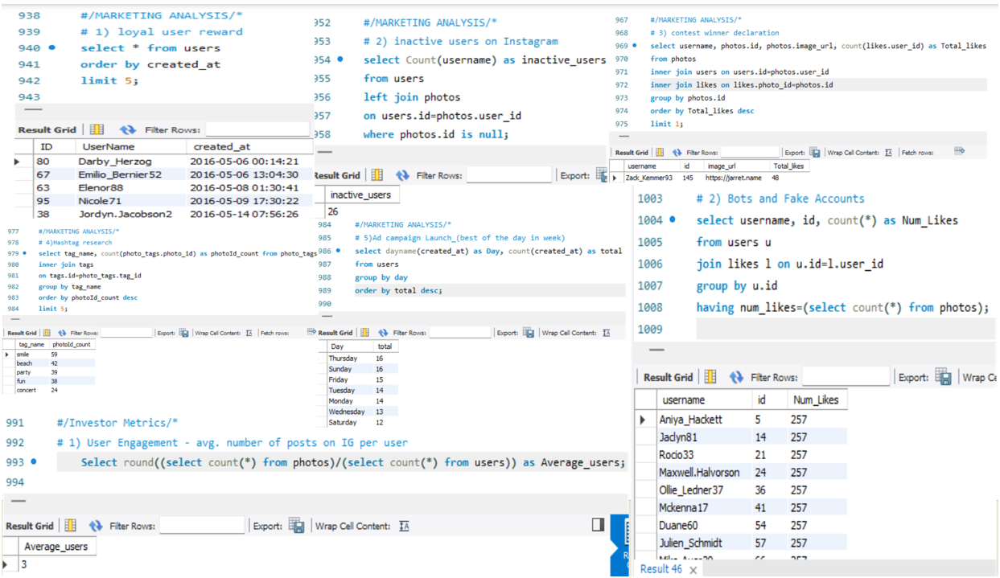

# Instagram User Analytics:
This project involves creating a database, inserting user and photo data, and performing complex SQL queries to analyze the platform’s user engagement, identify the contest winner, research hashtags, detect bots or fake accounts, and optimize ad campaign launches.

## Tech stack :
- Database Management System: MySQL
- Programming Language: SQL (Structured Query Language)

## Query SS

# Features:
- User Engagement Analysis: Measures how active users are on the platform by analyzing photo uploads.
- Contest Winner Declaration: Identifies the photo with the most engagement (likes) and declares the contest winner.
- Hashtag Research: Analyzes popular hashtags to assist in content strategy.
- Bots & Fake Account Detection: Flags suspicious accounts based on user behavior and engagement.
- Ad Campaign Launch Optimization: Helps identify the best time to launch an ad campaign based on user sign-up data.

# Conclusion
This project provides insights into how SQL and MySQL can be used to manage and analyze data on a photo-sharing platform, helping to optimize user engagement, identify the most popular content, detect fake accounts, and improve marketing strategies.

